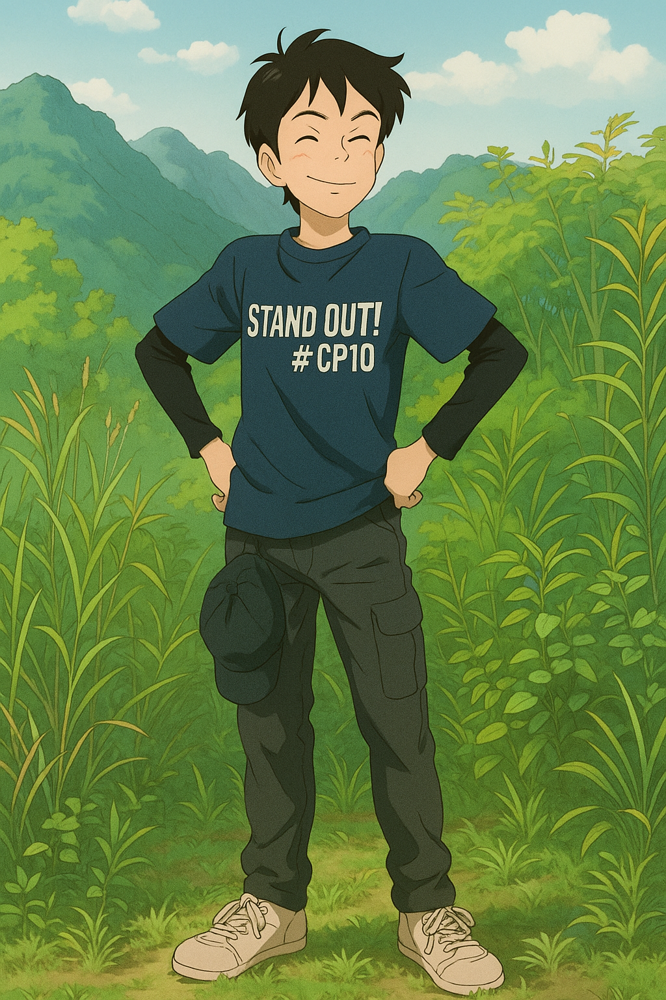

## Hi, I'm Elsar👋
  </a>

**🎓 Master's Student in Educational Technology | 💻 Frontend Developer (React, Tailwind, Bootstrap)**
I am interested in web development, particularly in the frontend field.
I am currently learning React, Tailwind CSS, and Laravel, and am interested in developing technology-based educational applications.

📍 Jakarta, Indonesia  
🔗 [LinkedIn](https://www.linkedin.com/in/raihan-elsar) • [Portfolio Website](https://raihanelsar.github.io)  
📫 Email: raihan.elsar25@gmail.com  

---

## 🛠️ Tech Stack

### 🌐 Frontend
  
  
  
  
  
  

### ⚙️ Backend & Database
  
  
  
  

### 🧰 Tools
  
  
  

---

## 🚀 Highlight Projects

- [**FoodDelivApps**](https://github.com/raihanelsar/FoodDelivApps) → Aplikasi pemesanan makanan online (UI modern & responsive).  
- [**Robotika**](https://github.com/raihanelsar/robotika) → Proyek robotika sederhana berbasis pemrograman.  
- [**Kalkulator BMI**](https://github.com/raihanelsar/kalkulatorbmi) → Aplikasi web sederhana untuk menghitung Body Mass Index.  
- [**Music Player**](https://github.com/raihanelsar/musicplayer) → Pemutar musik dengan UI interaktif berbasis JavaScript.  
- [**Landing Page**](https://github.com/raihanelsar/landingpage) → Website landing page responsif untuk portofolio/promo.  

> ✨ Lihat semua proyek saya di [GitHub](https://github.com/raihanelsar?tab=repositories)

---

## 📚 Currently Learning

- React & Tailwind CSS  
- Express  
- Teknologi pembelajaran berbasis Discord  

---

## 🤝 Connect with Me

- 🌐 [Portfolio Website](https://raihanelsar.github.io)  
- 💼 [LinkedIn](https://www.linkedin.com/in/raihan-elsar)  
- 📧 Email: raihan.elsar25@gmail.com 

---

✨ _Thanks for visiting my profile! Feel free to check out my repos and projects._ 🚀
